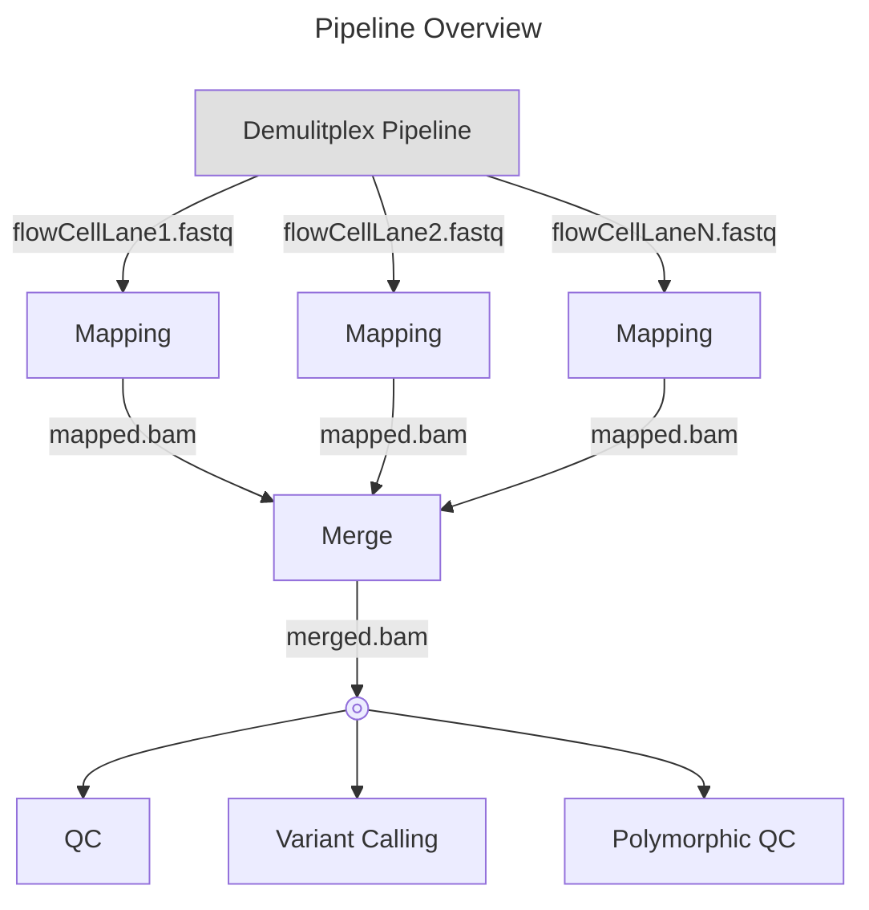
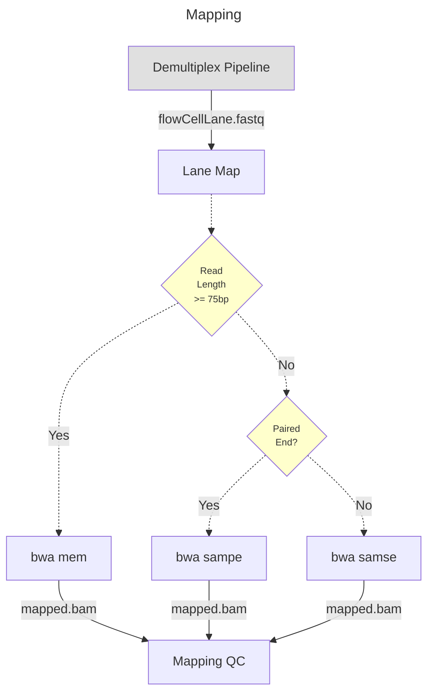
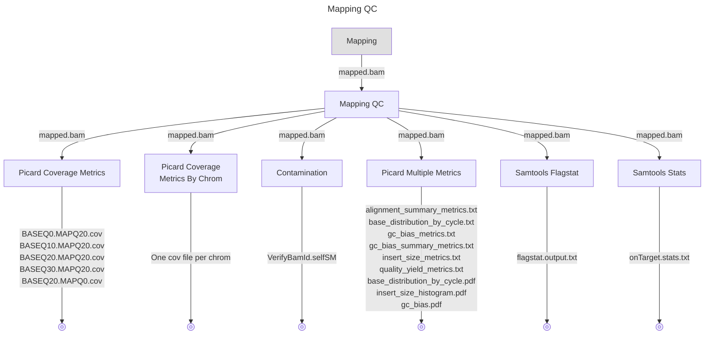
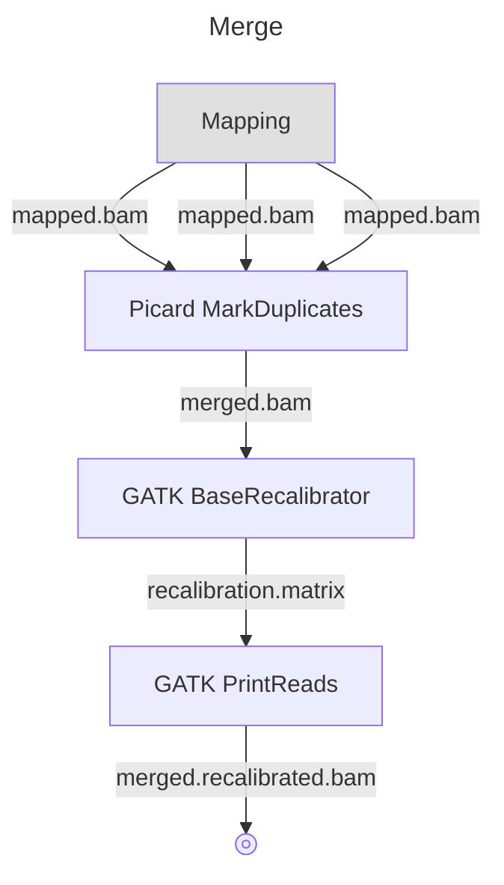
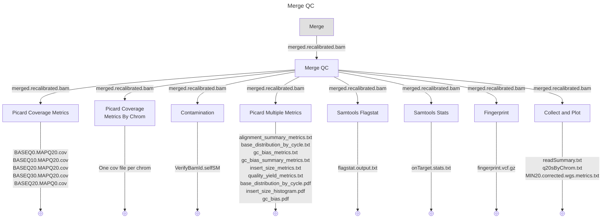

# nwgc-nf-shortread-rna-seq
[](https://www.gnu.org/licenses/gpl-3.0.txt)

Contact: nwgc-software@uw.edu

----

## Introduction

Short Read DNA Multi‑Step Variant Calling Pipeline
A Nextflow pipeline to process raw Illumina BCL files through alignment, recalibration, variant calling, annotation, and validation using industry‑standard tools.










```mermaid
---
title: Variant Calling (Main)
---
flowchart TD
    A["Merge"] -- "merged.recalibrated.bam" --> B
    style A fill:#E0E0E0
    B["GATK HaplotypeCaller"] -- "chrom1.gvcf" --> C
    C["GATK VariantAnnnotator"] -- "chrom1.annotated.gvcf" --> H
    A -- "merged.recalibrated.bam" --> D
    D["GATK HaplotypeCaller"] -- "chrom2.gvcf" --> E
    E["GATK VariantAnnnotator"] -- "chrom2.annotated.gvcf" --> H
    A -- "merged.recalibrated.bam" --> F
    F["GATK HaplotypeCaller"] -- "chromN.gvcf" --> G
    G["GATK VariantAnnnotator"] -- "chromN.annotated.gvcf" --> H
    H["GATK CatVariants"] -- "main.combined.gvcf" --> I
    I@{shape: fr-circ}```

```mermaid
---
title: Variant Calling (Filtered)
---
flowchart TD
    A["Merge"] -- "merged.recalibrated.bam" --> B
    style A fill:#E0E0E0
    B["GATK HaplotypeCaller"] -- "chrom1.gvcf" --> C
    C["GATK VariantAnnnotator"] -- "chrom1.annotated.gvcf" --> D
    D["GATK VariantFiltration"] -- "chrom1.annotated.filtered.gvcf" --> K
    A -- "merged.recalibrated.bam" --> E
    E["GATK HaplotypeCaller"] -- "chrom2.gvcf" --> F
    F["GATK VariantAnnnotator"] -- "chrom2.annotated.gvcf" --> G
    G["GATK VariantFiltration"] -- "chrom2.annotated.filtered.gvcf" --> K
    A -- "merged.recalibrated.bam" --> H
    H["GATK HaplotypeCaller"] -- "chromN.gvcf" --> I
    I["GATK VariantAnnnotator"] -- "chromN.annotated.gvcf" --> J
    J["GATK VariantFiltration"] -- "chromN.annotated.filtered.gvcf" --> K
    K["GATK CatVariants (Filtered)"] -- "filtered.combined.gvcf" --> L
    L@{shape: fr-circ}
 ```
