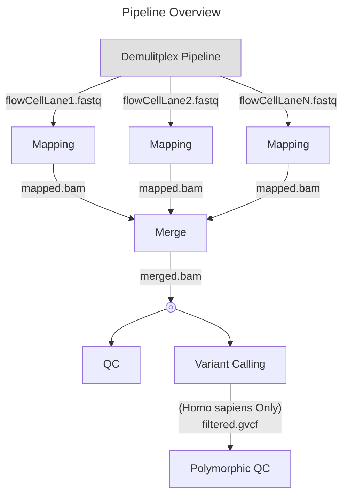
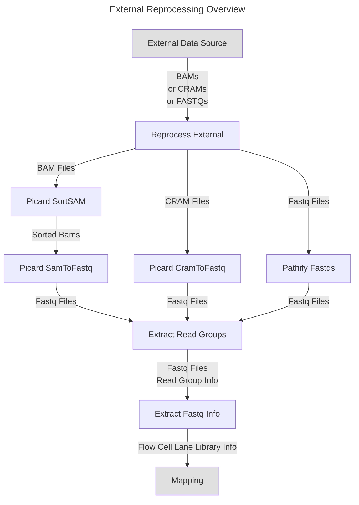
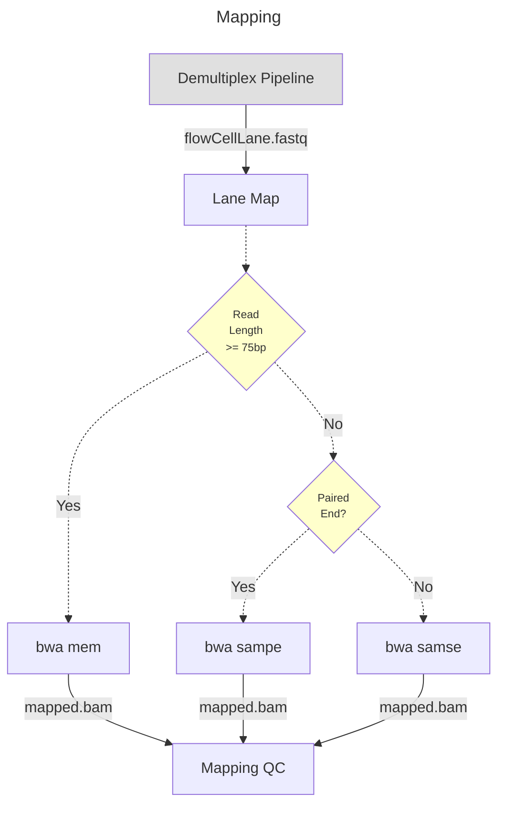
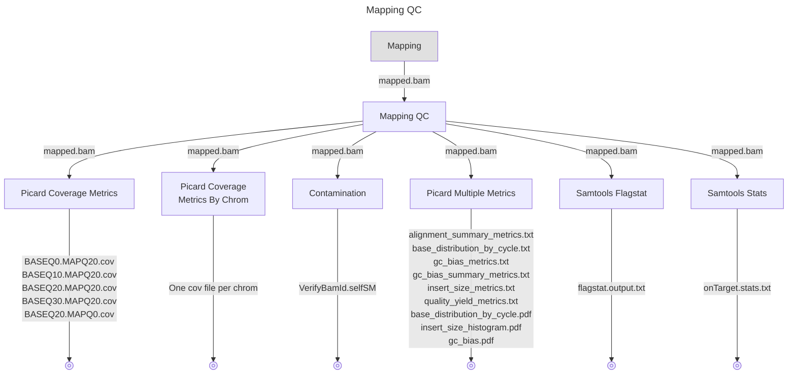
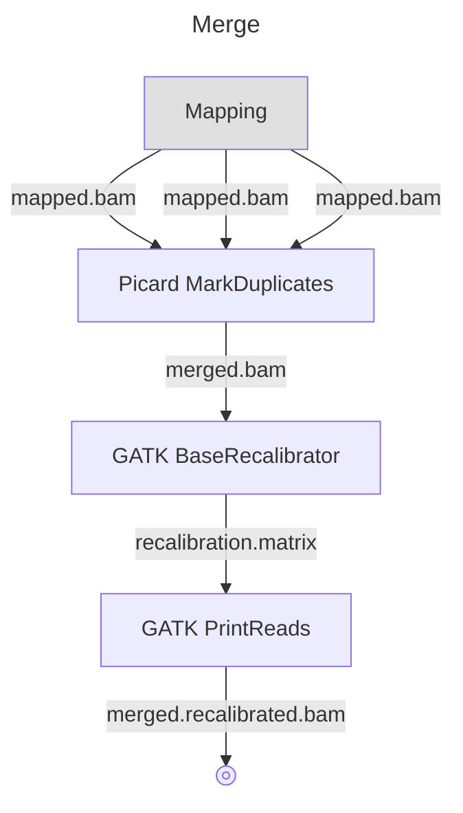
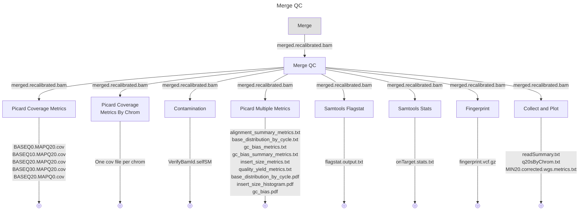
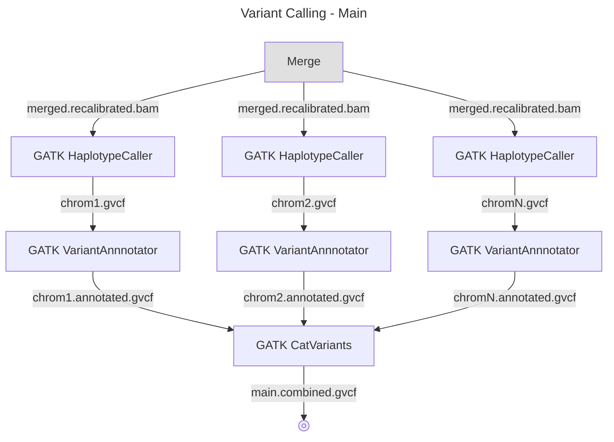

# nwgc-nf-shortread-rna-seq
[](https://www.gnu.org/licenses/gpl-3.0.txt)

Contact: nwgc-software@uw.edu

----

## Introduction

Short Read DNA Multi‑Step Variant Calling Pipeline
A Nextflow pipeline to process raw Illumina BCL files through alignment, recalibration, variant calling, annotation, and validation using industry‑standard tools.















```mermaid
---
title: Variant Calling - Filtered (Homo sapiens only)
---
flowchart TD
    A["Merge"] -- "merged.recalibrated.bam" --> B
    style A fill:#E0E0E0
    B["GATK HaplotypeCaller"] -- "chrom1.gvcf" --> C
    C["GATK VariantAnnnotator"] -- "chrom1.annotated.gvcf" --> D
    D["GATK VariantFiltration"] -- "chrom1.annotated.filtered.gvcf" --> K
    A -- "merged.recalibrated.bam" --> E
    E["GATK HaplotypeCaller"] -- "chrom2.gvcf" --> F
    F["GATK VariantAnnnotator"] -- "chrom2.annotated.gvcf" --> G
    G["GATK VariantFiltration"] -- "chrom2.annotated.filtered.gvcf" --> K
    A -- "merged.recalibrated.bam" --> H
    H["GATK HaplotypeCaller"] -- "chromN.gvcf" --> I
    I["GATK VariantAnnnotator"] -- "chromN.annotated.gvcf" --> J
    J["GATK VariantFiltration"] -- "chromN.annotated.filtered.gvcf" --> K
    K["GATK CatVariants (Filtered)"] -- "filtered.combined.gvcf" --> L
    L@{shape: fr-circ}
 ```

```mermaid
---
title: Polymorphic QC (Homo sapiens only)
---
flowchart TD
    A["Variant Calling - Filtered"] -- "filtered.gvcf" --> B
    style A fill:#E0E0E0
    B["BCFtools GVCF to VCF"] -- "filtered.vcf" --> C
    C["BCFtools SNPs Only"] -- "filtered.snps.vcf" --> D
    D["BCFtools Unfiltered Transition Transverions"] -- "transition_transverion.txt" --> E
    E@{shape: fr-circ}
    C -- "filtered.snps.vcf" --> F
    F["BCFtools Filtered Transition Transverions Stats"] -- "transition_transverion.filtered.txt" --> G
    G@{shape: fr-circ}
    C -- "filtered.snps.vcf" --> H
    H["BCFtools Percent Filtered GATK Stats"] -- "percent_filtered_gatk.txt" --> I
    I@{shape: fr-circ}
    C -- "filtered.snps.vcf" --> J
    J["BCFtools Hetrozygous Homozygous Stats"] -- "het_hom.txt" --> K
    K@{shape: fr-circ}
 ```

nwgc-nf-shortread-dna-seq is a nextflow pipeline for aligning and analyizig short read dna sequencing data.  The pipeline takes fastq files as input.

nwgc-nf-shortread-dna-seq uses NWGC modules as its main computing environment.  However, it could easily be adapted to use containers by creating containers corresponding to the NWGC modules.

## Contents

* [Introduction](#introduction)
* [Latest Updates](#latest-updates)
* [Usage](#usage)
* [Configuration](#configuration)

## Latest Updates

*v1.0.0 (June 28, 2024)*: Initial Release

## Usage

    The typical command for running the pipeline is as follows:
    
      nextflow run main.nf 
        -params-file SAMPLE_YAML
        -profile PROFILES
        -w WORKING_DIR
        -N USER_EMAIL
        -resume
        -name JOB_NAME

    Mandatory arguments:
      --params-file SAMPLE_YAML    Path to YAML file with sample information (see example-config.yaml in git repository)
      --profile PROFILES           Comma separated list of profiles that specify which instanceSize, executor and environment profiles to use.
                                   See PROFILES section below for details.
    
    Optional arguments:
      -w WORKING_DIR               Path to a directory to store all the work in (default is "work" in directory where pipeline is run
      -N USER_EMAIL                Your email address if you want an email when the pipeline finishes
      -resume                      Include this if you want to resume a pipeline that failed part way through
      -name JOB_NAME               If you want your pipeline to have a specific name (good for qsubbed pipelines)
    
    PROFILES
      You should specify 3 different types of profiles instanceSize, executor and environment.  A * below designates the most commonly used 
      profiles in our environment
      
      instanceSize
        instanceSizeHigh *          High memory, multiple cpus
        instanceSizeLow             Minimal memory and cpus, (Used for testing mostly)
         
      executor
        executorGridEngine *        Defines grid cluster options (project, runtime guestimates, etc.)
        executorLocal               This is used for testing on your local machine
         
      environment
        environmentUbuntu22 *       Defines modules in the NWGC Ubuntu environment
        environmentCentOS7          Defines modules in the NWGC CentOS environment (DEPRECATED)
        environmentContainer        Defines container(s) to use that have software preloaded (Currently not implemented)

## Configuration

The main configuration of the pipeline is done through a sample.yaml file.  The example-config.yaml file shows all the mandatory configuration parameters that should be supplied.  The following is a more detailed explanation of each of the parameters needed.


### User
*userId*  
The user id is used as part of the tag for nextflow modules.  The tag is also used as the job name when running on a cluster.  
(nextflow_tag:  \<module name>\_\<sample id>\_\<user id>)

*userEmail*  
This email address is used by nextflow to sends out emails upon workflow completion and/or errors.

*sequencingCenter*  
This name of the center where the sequencing was performed for the sample.  For NWGC samples this should be set to "University_of_Washington_Genome_Sciences".

### Sample
*sampleId*  
The id of the sample.  Sample id is used  as a prefix for some output files and as part of the tag for the nextflow modules.

*sampleDirectory*  
The sample directory on the local storage system.  Sample directory is used as the publish location for all merge output files.

*sampleFastxQCDirectory*  
The directory location to publish fastx qc results.

*sampleMappedBamsDirectory*  
The directory location to publish mapped bam results 

*sampleMappingQCDirectory*  
The directory location to publish mapped bam qc results.

*sampleQCDirectory*  
The directory location to publish merged bam qc results.

*samplePolymorphicQCDirectory*  
THe directory location to publish merged bam polymorphic qc results

*isNovaseqQCPool*  
Set to true if the sample data is for a Novaseq QC pool.  When this flag is set to true, the input fastqs will be downsampled in order to get quicker results.

*novaseqQCPoolPlexity*  
Used if isNovaseqQCPool is set to true.  THe number of samples in the Novaseq QC pool. This number is used in the  downsampling calculation.

### Target
*sequencingTarget*  
The name of the sequencing target for the sample.  This value will be used the final name for the merged bam.

*sequencingTargetIntervalsList*  
THe full path to intervals.list file that is specific to the sequencing target for the sample.  This is used by the qc step.

*targetListFile*  
THe full path to target.list file that is specific to the sequencing target for the sample.  This is used by the qc step.

*sequencingTargetIntervalsDirectory*  
The full path to the directory with chromosome intervals list files that are specific to the sequencing target for the sample.
Note: sequencingTargetIntervalsDirectory should be null unless running analysis by chromosome

*sequencingTargetBedFile*  
THe full path to target.bed file that is specific to the sequencing target for the sample.  This is used by the qc step.

### Reference Genome
*referenceGenome*  
The full path to the reference genome fasta.

*dbSnp*  
The full path to dbSnp file.

*goldStandardIndels*  
The full path to gold standard indels file.  Used by base quality recalibration step.

*knownIndels*  
The full path to known indels file.  Used by base quality recalibration step.

*referenceAbbr*
The reference genome abbreviation (grc38 or hg19)>.  Used as part of the file name when defining  chromosome interval files.

### Fingerprint
*fingerprintBedFile*
The full path to the fingerprint bed file.  Used when creating fingerprint vcf.

### Contamination (Optional, leave null to use default file path)
*contaminationUDPath*
The full path to contamination UD file.

*contaminationBedPath*
The full path to contamination Bed file.

*contaminationMeanPath*
The full path to contamination Mean file.

### Custom contamination target
*isCustomContaminationTargetSample*
Flag to indicate if the sample has a custom contamination target.

*customContaminationTargetReferenceVCF*
The full path to VCF file for a custom contamination target.

### Standard Mapping Input  - Flow Cell Lane Libraries
*flowCellLaneLibraries*  
Flow cell lane and fastqs info for fastq inputs.

*flowCellLaneLibraries.fastq1*  
Path to the fastq1 file.

*flowCellLaneLibraries.fastq2*  
Path to the fastq2 file.

*flowCellLaneLibraries.flowCell*  
The name of the flow cell.

*flowCellLaneLibraries.lane*  
The lane number of the flow cell.

*flowCellLaneLibraries.library*  
The library id.

*flowCellLaneLibraries.runDate*  
The run date of the flow cell.

*flowCellLaneLibraries.readLength*  
The read length of the flow cell.

*flowCellLaneLibraries.readType*  
The read type of the flow cell (PE,SE).

*flowCellLaneLibraries.sequencingPlatform*    
The sequencing platform of the flow cell (Illumina,Element)

### Standard Merging Input- Mapped Bams
*mappedBams*  
Bam file that have been mapped that need to be merged together to create the final bam an vcf.

*mappedBams.bam*  
The full path to mapped bam.

*mappedBams.bai*  
The full path to the index bai file.

*mappedBams.flowcell*  
The name of the flow cell for the mapped bam.

*mappedBams.lane*  
The flow cell lane for the mapped bam.

*mappedBams.library*  
The library id from the mapped bam

### Specialized Inputs
# mergedBam (for running qc on an already existing merged bam)
*mergedBam*  
The full path to a merged bam that contains nm tags."

# filteredGVCF (for running polymorphic qc on already a sample with variants already called
*filteredGVCF*  
The full path to a filtered_gvcf file.

### External Reprocessing Input
# External CRAMs
*camsForReprocessing*  
Cram files and their references to be split back into fastqs and completely reprocessed.

*cramsForReprocessing.cram*  
The full path to the cram file.

*cramsForReprocessing.reference*  
The full path to the reference file that was used to create the cram.

# External BAMs
*bamsForReprocessing*  
Bam files to be split back into fastqs and completely reprocessed.  Full path to bam per line.

# External Fastqs
*externalFastqs*
Fastq files that have no associated FCLL information to be reprocessed.  
If the library id is left out it will be assumed that all fastqs are from the same library.

*externalFastqs.fastq1*  
The full path to fastq read 1.

*externalFastqs.fastq2*  
The full path to fastq read 2.

*externalFastqs.library*  
Optional library id.

### Optional Params
*samToFastqValidationStringency*
Optional value if need to silence samToFastq errors - "SILENT".

# Optional Params Already defaulted in nextflow.config file
# QC is defaulted to all steps which is ["coverage", "coverage_by_chrom", "contamination", "fingerprint", "picard_multiple_metrics", "samtools_flagstat", "samtools_stats", "collect_and_plot"]
# Mapping QC is defaulted to ["coverage", "coverage_by_chrom", "contamination", "picard_multiple_metrics", "samtools_flagstat", "samtools_stats"]
*organism*  
Default is "Homo sapiens".  Use this param if species for the sample is other than Homo sapiens ("Mus musculus").

*isGRC38*  
Default is true.  Set this param to false if sample is not being mapped to grc38 (i.e. is hg19)

*pipelineStepsToRun*  
List of pipeline steps to run.
Default is every step: ["fastx_qc", "mapping", "mapping_qc", "merging", "qc", "variant_calling", "polymorphic_qc"]
Typical mapping use:   ["mapping", "mapping_qc"]
Typical merging use:   ["merging", "qc", "variant_calling", "polymorhic_qc"]

*qcToRunCustom*  
List of qc steps to run on the merged bam.
Default is every step: ["coverage", "coverage_by_chrom", "contamination", "fingerprint", "picard_multiple_metrics", "samtools_flagstat", "samtools_stats", "collect_and_plot"]

*qcToRunMapping*  
List of qc steps to run on each mapped bam.
Default is: ["coverage", "coverage_by_chrom", "contamination", "picard_multiple_metrics", "samtools_flagstat", "samtools_stats"]

### Modules
The modules used for the steps are specified in /config/profiles/environment/environmentUbuntu22.config file.
