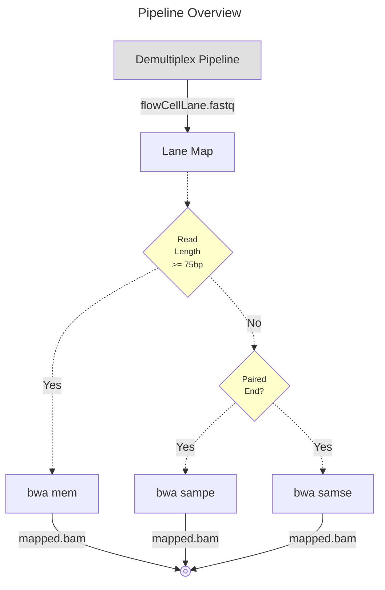

# nwgc-nf-shortread-rna-seq

Contact: nwgc-software@uw.edu

----

## Introduction

Short Read DNA Multi‑Step Variant Calling Pipeline
A Nextflow pipeline to process raw Illumina BCL files through alignment, recalibration, variant calling, annotation, and validation using industry‑standard tools.

