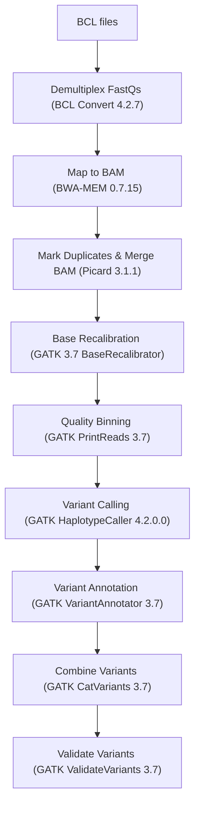

Basic Pipeline overview.
===
Multi‑Step Variant Calling Pipeline
A Nextflow pipeline to process raw Illumina BCL files through alignment, recalibration, variant calling, annotation, and validation using industry‑standard tools.

